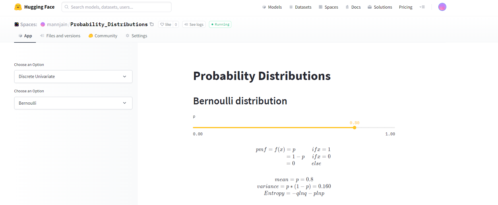
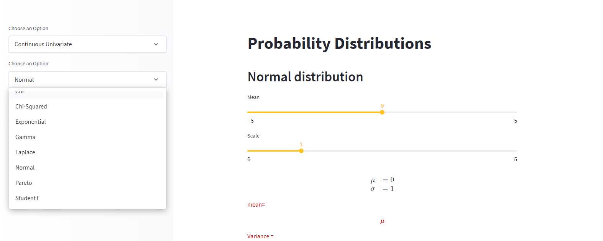
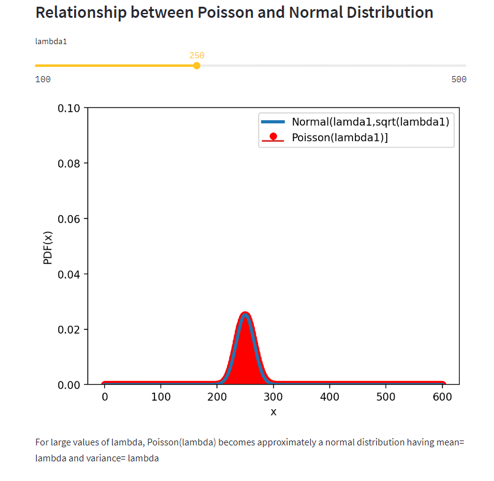

# Visualisations-of-Probability-Distributions
This project visualizes different continuous and discrete probability distributions with their properties.
 
The python library `Tensorflow-Probability` is used for various distributions. 
 The web app is deployed using `streamlit`.

### Files and Folders
The repository contains three files:    
* `app.py` : The main file containing the logic  and algorithms of all the distributions.
* `plot.py`: The file for plotting the graph.
* `requirements.txt` : The file containing all the imported libraries.
 
  
### Deployment
The web app is deployed on the **Hugging Face Spaces**.
 
**Web App**  
https://huggingface.co/spaces/ayush21/Probability-Distributions

### Screenshots

UI

Various distributions

Graphs with properties

